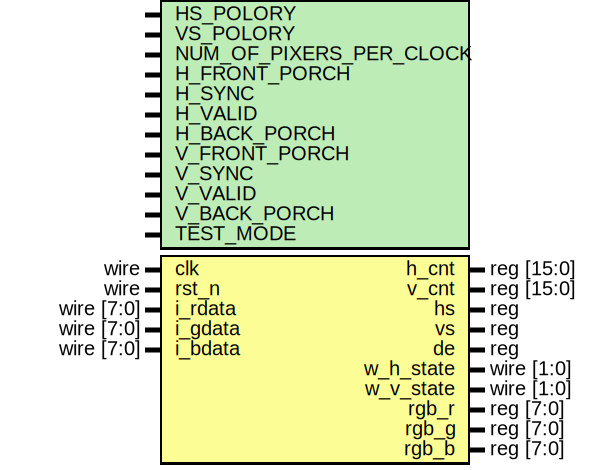
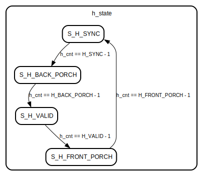
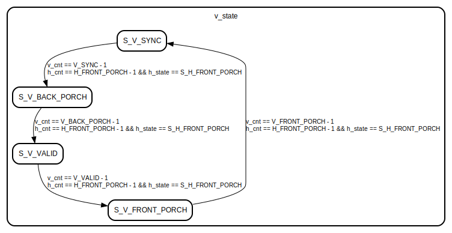

# Entity: color_bar_rgb 

- **File**: color_bar_rgb.v
## Diagram

## Generics

| Generic name            | Type | Value   | Description |
| ----------------------- | ---- | ------- | ----------- |
| HS_POLORY               |      | 1'b1    |             |
| VS_POLORY               |      | 1'b1    |             |
| NUM_OF_PIXERS_PER_CLOCK |      | 2'b01   |             |
| H_FRONT_PORCH           |      | 13'd100 |             |
| H_SYNC                  |      | 13'd100 |             |
| H_VALID                 |      | 13'd384 |             |
| H_BACK_PORCH            |      | 13'd100 |             |
| V_FRONT_PORCH           |      | 13'd4   |             |
| V_SYNC                  |      | 13'd5   |             |
| V_VALID                 |      | 13'd288 |             |
| V_BACK_PORCH            |      | 13'd4   |             |
| TEST_MODE               |      | 2'd0    |             |
## Ports

| Port name | Direction | Type       | Description |
| --------- | --------- | ---------- | ----------- |
| clk       | input     | wire       |             |
| rst_n     | input     | wire       |             |
| i_rdata   | input     | wire [7:0] |             |
| i_gdata   | input     | wire [7:0] |             |
| i_bdata   | input     | wire [7:0] |             |
| h_cnt     | output    | reg	[15:0] |             |
| v_cnt     | output    | reg	[15:0] |             |
| hs        | output    | reg        |             |
| vs        | output    | reg        |             |
| de        | output    | reg        |             |
| w_h_state | output    | wire [1:0] |             |
| w_v_state | output    | wire [1:0] |             |
| rgb_r     | output    | reg [7:0]  |             |
| rgb_g     | output    | reg [7:0]  |             |
| rgb_b     | output    | reg [7:0]  |             |
## Signals

| Name    | Type       | Description |
| ------- | ---------- | ----------- |
| h_state | reg	[1:0]  |             |
| v_state | reg	[1:0]  |             |
| hs_r1   | reg        |             |
| vs_r1   | reg        |             |
| de_r1   | reg        |             |
| data    | reg [23:0] |             |
## Constants

| Name            | Type | Value | Description |
| --------------- | ---- | ----- | ----------- |
| WHITE_R         |      | 8'hff |             |
| WHITE_G         |      | 8'hff |             |
| WHITE_B         |      | 8'hff |             |
| YELLOW_R        |      | 8'hff |             |
| YELLOW_G        |      | 8'hff |             |
| YELLOW_B        |      | 8'h00 |             |
| CYAN_R          |      | 8'h00 |             |
| CYAN_G          |      | 8'hff |             |
| CYAN_B          |      | 8'hff |             |
| GREEN_R         |      | 8'h00 |             |
| GREEN_G         |      | 8'hff |             |
| GREEN_B         |      | 8'h00 |             |
| MAGENTA_R       |      | 8'hff |             |
| MAGENTA_G       |      | 8'h00 |             |
| MAGENTA_B       |      | 8'hff |             |
| RED_R           |      | 8'hff |             |
| RED_G           |      | 8'h00 |             |
| RED_B           |      | 8'h00 |             |
| BLUE_R          |      | 8'h00 |             |
| BLUE_G          |      | 8'h00 |             |
| BLUE_B          |      | 8'hff |             |
| BLACK_R         |      | 8'h00 |             |
| BLACK_G         |      | 8'h00 |             |
| BLACK_B         |      | 8'h00 |             |
| S_H_BACK_PORCH  |      | 2'd0  |             |
| S_H_SYNC        |      | 2'd1  |             |
| S_H_VALID       |      | 2'd2  |             |
| S_H_FRONT_PORCH |      | 2'd3  |             |
| S_V_BACK_PORCH  |      | 2'd0  |             |
| S_V_SYNC        |      | 2'd1  |             |
| S_V_VALID       |      | 2'd2  |             |
| S_V_FRONT_PORCH |      | 2'd3  |             |
## Processes
- unnamed: ( @( posedge clk or negedge rst_n ) )
  - **Type:** always
- unnamed: ( @( posedge clk or negedge rst_n  ) )
  - **Type:** always
- unnamed: ( @( posedge clk or negedge rst_n ) )
  - **Type:** always
- unnamed: ( @( posedge clk or negedge rst_n ) )
  - **Type:** always
- unnamed: ( @( posedge clk or negedge rst_n ) )
  - **Type:** always
- unnamed: ( @( posedge clk or negedge rst_n) )
  - **Type:** always
## State machines

